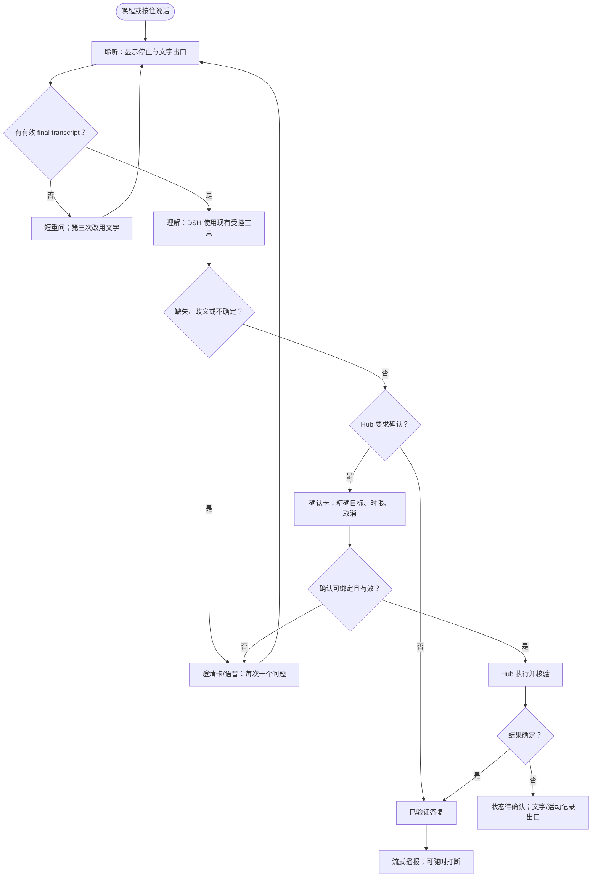

# 私有语音运行时

状态：Phase 0 架构与产品决策。本文定义一条可本地部署的语音输入、理解和播报路径；它不引入新的自动化运行时、设备执行入口或家庭成员等级体系。

## 产品能力：让家庭自己拥有的 Jarvis

“用户自建 Jarvis”不是把一个模型地址填进设置页。它是一项产品能力：家庭可以选择并验证在自己设备和网络中运行的语言、识别和语音服务，同时仍获得同一套可理解、可打断、可审计的家庭协作体验。

这项能力的承诺是：

- 家庭能在不上传持续麦克风音频、转写或家庭上下文的前提下完成日常语音请求；本地部署是可选能力，云端或浏览器转写仍是独立的产品选择。
- 家庭能独立替换 LLM、ASR 或 TTS 的实现，不会因此改变 Hub 的设备权限、确认规则或证据记录。
- 家庭能看到当前在“听取、理解、等待确认、执行、核验、播报”的哪一步，并能随时停止聆听、停止播报或改用文字。
- 语音识别错误、模型不确定或设备状态未知时，系统会说清楚未知之处并提供恢复出口；它不会把猜测说成已完成，也不会用听到的声音伪造身份。

因此，语音是 DSH 对话的一个输入与输出通道，不是一个拥有家庭控制权的助手。Home Assistant 是一个可接入的设备生态桥，而不是语音运行时的中心。

## 独立的三条可插拔轨道

三条轨道分别拥有配置、健康探测、降级和替换策略。它们只通过明确的会话边界协作，任何一条失败均不会赋予另一条额外权限。

| 轨道 | 职责与最小输出 | 参考实现 | 不拥有的职责 |
| --- | --- | --- | --- |
| LLM | 将已接受的文字 turn 交给 DSH Agent loop；流式返回文字、工具进度与最终答复。 | 本地 OpenAI-compatible deployment，作为 `custom/<model-id>`，沿用 DSH `openai-completions` route。 | 音频采集、说话人身份、HA native service、设备执行。 |
| ASR | 在本地把有限时长的语音流转成 partial 和 final transcript，附带置信度/端点状态。 | Wyoming ASR server；OpenAI-compatible HTTP ASR；也可用浏览器 Web Speech 作为显式降级输入。 | 解释意图、确认动作、持久保存原始音频。 |
| TTS | 将由产品选择的、已脱敏且有长度上限的播报文本流式/分段合成为音频。 | Wyoming TTS server；OpenAI-compatible HTTP TTS 可直接接入或由 Wyoming bridge 适配。 | 选择设备、修改队列、绕过媒体确认或直接调用 HA。 |

### LLM：沿用现有 DSH provider seam

`packages/agent-layer/src/model/model-providers.ts` 已把 `custom` 定义为独立的 OpenAI-compatible provider，并要求显式 base URL。`packages/agent-layer/src/model/provider-live-probe.ts` 已通过 DSH 做最小流式文本探测；新运行时必须复用这条路径，而不是在 Hub 或语音客户端自写 OpenAI HTTP client。

本地 LLM 配置使用 `custom/<deployment-model-id>`。它保留现有约束：端点只接受 HTTPS、没有 URL userinfo/query/fragment、模型由家庭显式选择、不因 `/models` 枚举而扩大可用模型或工具。DSH profile credential provider 每次操作从 SecretVault 读取选中的 secret；语音进程、浏览器、日志和产品配置只得到 secret reference，绝不得到 secret 值。

### ASR/TTS：定义窄的语音传输适配器

Wyoming 是 ASR 和 TTS 的兼容传输选择，而不是 Hub contract。语音 gateway 为每条连接维护一个短生命周期的 `voiceTurnId`，把音频帧交给一个 ASR provider，并接收类似下列的内部事件：

```ts
type AsrEvent =
  | { type: "ready" }
  | { type: "partial"; text: string; stability?: number }
  | { type: "endpoint"; reason: "silence" | "manual_stop" | "max_duration" }
  | { type: "final"; text: string; confidence?: number }
  | { type: "failed"; reason: "unavailable" | "timeout" | "invalid_audio" };
```

这是 gateway 内部类型，不进入 `contracts`，也不把 Wyoming frame、模型名称或端口泄漏给 Agent。最终 transcript 的长度、控制字符、语言/采样参数和 session ownership 都在 gateway 校验；partial 只用于当前 UI，不自动作为 DSH 输入或工具参数。

HTTP ASR/TTS 使用各自的窄适配器。ASR 只接收受限音频流和 locale，产出受限 partial/final 事件；TTS 提供 `health()`、`synthesize({ text, voice, locale, signal })`，返回有 MIME type、有限时长及可取消字节流的音频结果。若已有 HTTP-only TTS 服务，Wyoming TTS bridge 可以作为接入适配器；若使用 Wyoming TTS，直接适配相同的 `synthesize` 端口。两种 transport 都不能接受 URL、SSML 指令、设备标识或任意 provider payload 作为“文本”。

本地音频可在语音 gateway/客户端播放，也可作为被明确准备的媒体内容交给媒体层；第二种情况必须通过 Hub 的中立媒体与动作规则。TTS 不自行挑选播放器。

## 语音 turn：人、Agent 与 Hub 的权限边界

```text
麦克风 / 唤醒词 / 按住说话
  -> 私有 Voice Gateway（音频、VAD、ASR、TTS transport）
  -> 已校验的 final text + voiceTurnId
  -> DSH Agent loop（解释、查询、提出澄清或调用受控工具）
  -> Hub（世界模型、媒体准备、策略、确认、执行、核验、审计）
  -> 文字答复 / 已验证结果
  -> Voice Gateway（TTS、播放、可打断）
```

| 层 | 可以做什么 | 必须不能做什么 |
| --- | --- | --- |
| Voice Gateway | 管理麦克风同意、wake/press-to-talk、端点检测、ASR/TTS stream、显示 partial、停止本 turn。 | 获取 Hub action ticket、调用 bridge/HA API、从声纹推出 actor、将 partial 自动提交。 |
| DSH Agent loop | 用文本理解意图，读取 Hub 提供的中立事实，发起受控的查询、媒体对话或提案工具调用。 | 接收 raw audio、直接设备控制、消费批准票据、把一句“确认”解释为未绑定的通用授权。 |
| Hub | 保留媒体 prepare/confirmation、一次性动作策略、批准绑定、执行、后置核验与审计的唯一权威。 | 信任语音内容、TTS 文本或 HA native 数据来扩大权限。 |
| HA bridge | 作为一个 bridge adapter 映射其平台事件/动作，接受 Hub 已治理的边缘请求。 | 主持 wake word、ASR、TTS、Agent session 或最终动作政策。 |

现有 `HomeMediaConversationService` 已使用 opaque `mediaRef`、中立 player capability、显式 queue mode、准备和确认。语音只可以把 DSH 已得到的 structured clarification/confirmation 说出来；它不能构造 `mediaRef`，也不能绕过 `HomeMediaPlaybackPreparationService` 或 `HouseholdReviewCenterService`。

同样，`one-shot-action-plane` 的 `pending_confirmation`、`verified`、`failed`、`unknown` 仍是结果权威。对语音说出的“确认”只在该 ticket 正在等待、同一个具体 turn、现有 actor/私有设备要求满足且票据未过期时才是一个确认输入。没有这些条件时，系统转为文字/屏幕确认或重新澄清。普通同屋说话、录音回放、媒体歌词和外部设备名称均是非可信输入，不能创建 actor 或提升权限。

## 状态机与恢复

`packages/inbox-web/src/voice-surface.ts` 已存在受控 Web Speech 的展示状态。私有运行时将其扩展为一个 runtime turn machine，而不要求浏览器或 HA 成为协议中心。状态以 `voiceTurnId` 隔离；同一时刻每个采集端只能有一个活跃 turn。

| 状态 | 进入事件与产品呈现 | 合法离开 / guard |
| --- | --- | --- |
| `idle` | 默认；显示“开始聆听”和文字出口。 | 唤醒词或按住说话 -> `wake_detected`；浏览器不支持/权限不可用 -> `text_mode`。 |
| `wake_detected` | 简短提示音后打开本 turn 的麦克风；wake word 本身不进入 transcript。 | 已获麦克风同意 -> `listening`；拒绝 -> `permission_denied`。 |
| `listening` | 显示持续采集与“停止”；VAD 保留有限预卷。 | ASR partial -> `partial`; 端点/手动停止 -> `finalizing`; 超时/空音频 -> `no_input`。 |
| `partial` | 只显示暂定转写和“继续说”；不执行，不提交。 | 新 partial -> `partial`; endpoint -> `finalizing`; 取消 -> `interrupted`。 |
| `finalizing` | 停止采集，等待受限 ASR final。 | 有效 final -> `understanding`; 空/低置信 -> `clarifying` 或 `no_input`; 失败 -> `failed`。 |
| `understanding` | final text 作为一个 DSH user turn；UI 显示已收到且允许“改用文字/停止等待”。 | 需要缺失或歧义信息 -> `clarifying`; 有待确认 action -> `confirming`; 仅回答/查询 -> `speaking`; 工具失败 -> `failed`。 |
| `clarifying` | 每次只问一个缺失槽位，并保留已理解部分。 | 用户回答 -> `listening`; 明确取消/文字接管 -> `interrupted`/`text_mode`; 三次无法恢复 -> `failed`。 |
| `confirming` | 朗读并展示精确目标、效果、风险/时限与“确认/取消”；高风险始终给屏幕确认出口。 | 有效绑定确认 -> `executing`; 取消/过期 -> `interrupted`; 不能证明绑定 -> `clarifying` 或屏幕确认。 |
| `executing` | Hub 已接受动作请求；显示不可逆的真实进度。 | Hub terminal result -> `verifying` 或 `failed`; 连接不确定 -> `indeterminate`。 |
| `verifying` | Hub 读取后置条件；不得先报成功。 | 已验证 -> `speaking`; failed -> `failed`; 无法判定 -> `indeterminate`。 |
| `speaking` | TTS 流式播报已验证答复/状态。 | 音频结束 -> `idle`; 新语音/VAD barge-in -> `interrupted` 后进入新的 `listening`。 |
| `interrupted` | 停止采集、生成或播报；保留已提交 turn 的可见状态。 | 未提交的 turn -> `idle`; 已进入 Hub 执行/核验的 turn -> `verifying` 或 `indeterminate`，不能假装取消了动作。 |
| `failed` / `indeterminate` | 说明失败类别或不确定性，并提供重试、文字和退出。 | 新 turn -> `idle`；`indeterminate` 只可由 Hub 的新鲜读取/人工复核结束。 |
| `permission_denied` / `text_mode` | 显示权限说明或直接文字输入；不循环请求权限。 | 明确重新尝试或文字会话。 |

状态不允许 `listening + speaking`、`partial + execution` 或“已验证但没有 Hub result”等组合。UI 对应现有 voice surface 的可访问实时状态，屏幕只是加强说明：每段播报在无屏幕时也应可理解，确认信息一次不超过三个核心事实。

当前实现以 `packages/hub/src/voice/private-voice-turn-machine.ts` 提供确定性的纯 reducer。它按 `voiceTurnId` 隔离状态，并把采集、DSH、TTS 与 Hub 的工作表达成受调用方执行的 effect。该 reducer 已覆盖 partial 仅用于展示、final 端点后只提交一次、三阶无输入恢复、绑定确认、Hub 结果裁决、超时、取消与 barge-in。它不启动音频、不执行工具，也不代替 Hub 保存或核验动作结果。

### 屏幕级流与恢复出口



无输入采用递进式重问：第一次用更短提示，第二次给一个家庭语境示例，第三次停止语音并保留文字入口。权限被拒绝时只解释如何在浏览器/设备开启；不反复触发权限弹窗。任何超过十秒的模型、桥或工具等待均显示正在做什么、继续后台处理与取消等待；取消等待保留当前 turn，且不取消已经由 Hub 接管的动作。

## Barge-in、端点检测、流式与延迟

### Barge-in

- 在 `speaking` 中，新的 wake/press-to-talk 或可靠语音活动立即淡出/停止本地播放，取消未完成 TTS 和可取消的 DSH 文本 stream，然后新建 `voiceTurnId` 进入聆听。
- 在 `understanding` 中，barge-in 取消尚未开始的 DSH/检索工作并保留文本记录；已产生的 partial 工具输出不能当作结果播报。
- 在 `confirming` 中，新的语音先被当作“澄清或取消”请求；只有绑定 ticket 和明确确认语法都满足时才提交确认。
- 在 `executing` 或 `verifying` 中，barge-in 停止播报和本地等待，但不撤销已经被 Hub 原子认领的动作。系统继续读取真正结果，必要时播报/显示 `indeterminate`。

### 端点检测与流式纪律

客户端/gateway 使用 VAD 进行端点检测，采用有限 pre-roll、最大连续录音时间、最短发声时长和短静音阈值。手动停止永远优先。VAD 只决定“何时送 final”，不判断意图、更不授权；环境噪声、电视和 TTS 回声必须可导致 `no_input`/`clarifying`，而不是设备动作。

ASR partial 以节流的文本增量送到当前 UI，final 只在端点后提交一次。DSH 和 TTS 使用 `AbortSignal`/可取消 stream；每个 stream 包含 turn correlation id，但日志只保留事件类别、时长和受限错误码，不保留原始音频、完整 transcript 或凭据。TTS 可在短、稳定的答复块确认后开始合成；对确认、失败和行动结果必须等待 Hub 的最终结构化状态，不能根据模型预测提前播报完成。

### 面向产品的延迟预算

这些是初始 P95 目标，不是对任一模型或硬件的承诺；设置页显示最近 probe/turn 的分类耗时，而不显示私有拓扑。

| 片段 | 目标 | 超过目标时的反馈 |
| --- | ---: | --- |
| 按住说话/唤醒到录音提示 | 250 ms | 立即显示/播放正在开始；1 秒仍未开始则给文字入口。 |
| VAD endpoint 到首个 partial | 500 ms | 继续显示“正在听”；不把 partial 当 final。 |
| endpoint 到 ASR final | 1.5 s | 显示“整理刚才的话”，3 秒后允许重说或改用文字。 |
| final 到 DSH 首个可见进度 | 1 s | 显示当前受控检查；不伪造确定答案。 |
| 简短、无工具答复的首段语音 | 2.5 s | 先播放简短等待提示，仍可打断。 |
| Hub 查询/确认准备 | 5 s | 展示正在核对的目标与取消等待。 |
| 任一仍在运行的步骤 | 10 s | 提供后台继续、取消等待和文字接管，保留 active turn。 |

## Setup、配置、Vault 与 Probe

语音运行时应延续 `ProductRuntimeSupervisor`、`ProductSetupController` 和 `ProductBootstrapConfigStore` 的单一、短时 setup transaction。模型和 bridge 的现有 setup 不改变；语音新增一个独立阶段，只有各轨道 probe 通过才可激活。配置是本地非 secret 元数据，secret 只在 Vault 中保存为引用。

建议的持久化 shape（示意，待实现时以 strict Zod schema 冻结）如下：

```ts
interface PrivateVoiceRuntimeConfig {
  readonly version: "hob.private-voice/v1";
  readonly enabled: boolean;
  readonly input: {
    readonly mode: "push_to_talk" | "wake_word";
    readonly locale: string;
    readonly maxTurnDurationMs: number;
    readonly endpoint: { readonly minSpeechMs: number; readonly trailingSilenceMs: number };
  };
  readonly asr: {
    readonly transport: "wyoming" | "openai_http" | "browser";
    readonly endpoint?: string;
    readonly credentialRef?: string;
  };
  readonly tts: {
    readonly transport: "wyoming" | "openai_http" | "disabled";
    readonly endpoint?: string;
    readonly credentialRef?: string;
    readonly locale: string;
    readonly voice?: string;
  };
  readonly diagnostics: { readonly retainAudio: false; readonly retainTranscript: false };
}
```

实现 schema 时遵守以下规则：

- 配置允许标识、transport、局域服务 endpoint、语言、超时、非敏感 voice label 与 `SecretRef`；不允许 token/password/key 字段、用户可选 URL path/query/userinfo、任意 headers、HA entity/service、播放器、模型工具策略或家庭成员角色。
- 每个 endpoint 有严格 scheme、host、端口、长度和私网/本机部署策略校验；DNS 重绑定和重定向不得把 probe 变成任意网络访问。部署策略由宿主产品决定，并保持与现有 `custom` LLM HTTPS 规则分开。
- ASR/TTS credential 如有需要，使用 `keychain:hob-agent/voice:<track>:<setup-id>:<nonce>` 形式的 request-local stage ref；probe 失败、草稿过期或设置冲突时删除。激活配置仅保存最终 `SecretRef`，其目录/文件延续 `0700`/`0600` 与原子 generation commit 纪律。
- 不把 LLM secret 复制为语音 secret。LLM 继续引用已选 model profile；ASR 与 TTS 可各自没有 credential、各自持有一个不同 ref，或者被禁用。
- 关闭语音即停止 gateway 与音频采集，不删除模型/HA/媒体设置；它也不改变现有 `/conversation` 文字通道。

`ProductVoiceSetup` 以这条契约实现了独立 ASR/TTS 的 staged probe：它接收 `wyoming` 或 `openai_http` transport、规范化本机或私网的无路径 endpoint，并返回 `ready`、`credential_rejected`、`endpoint_unreachable`、`timed_out`、`incompatible` 或 `unavailable` 的闭合结果。`ProductRuntimeSupervisor` 将它与 `PrivateVoiceRuntimeService` 挂载在同一 Cordis 根下；挂载本身不会打开麦克风或音频流。它把请求中的 credential 仅交给当前 probe，成功时只留下 track-scoped locator；它不选择 primary profile，也不激活家庭运行时。

当前 built-in transport 已能进行真实的有限探测与数据交换：`OpenAiHttpVoiceTransport` 固定使用 `/v1/audio/transcriptions` 与 `/v1/audio/speech`，允许家庭显式选择私有部署暴露的 ASR/TTS model id，并限制音频、文本、响应类型、响应大小、重定向、超时和取消；`WyomingVoiceTransport` 实现 `describe/info`、ASR audio stream 与 TTS audio stream，限制 frame、event、text 和累计音频。Wyoming 协议本身没有 bearer credential 字段，因此产品不会接收一个实际无法发送的 Wyoming token。两种 transport 都只返回闭合错误分类，不把内网 endpoint、provider body 或 secret 变成产品文案。

`PrivateVoiceRuntimeService` 按 capture surface 隔离 turn machine，允许手机、墙面屏或自建语音卫星各自保留一个可打断的会话。它只保存状态并返回 effect；ASR/TTS/DSH/Hub 的实际调用仍由后续 gateway 组合执行。Hub 已认领的动作在卫星断开时保留可核验状态，语音服务无权把“停止播报”解释为“动作已取消”。

Probe 是一次性、低权限且不改变家庭状态的操作：LLM 复用现有最小 DSH 流式 probe；ASR 对有限合成/fixture 音频验证 `ready -> final`；TTS 对固定非家庭文本验证 health、可解码的有限音频；Wyoming probe 验证 capability/locale 而非依赖某个实现的内部字段。probe 只返回稳定分类（如 `ready`、`credential_rejected`、`endpoint_unreachable`、`timed_out`、`incompatible`）和耗时。它不得记录 prompt、音频、transcript、response、endpoint private detail 或 secret。

## Phase 0 最小纵切

Phase 0 只交付一个可验证、默认安全的纵切，不增加自定义 automation runtime：

1. 在设置中创建一个 `push_to_talk` 私有语音 profile：选择 locale，分别配置并 probe 一个 Wyoming ASR 与一个 Wyoming 或 HTTP TTS；LLM 复用已完成的 `custom` model profile。
2. Voice Gateway 接受有限 PCM/浏览器音频，执行 VAD 与 ASR，向现有 voice surface 发送 partial/final；浏览器 Web Speech 仍是显式 `text_mode`/兼容降级，不能与私有 ASR 混淆。
3. 仅将严格校验的 final 文本作为既有 `/conversation`/DSH 会话的 user turn。先覆盖只读家庭问答和现有媒体搜索/准备；媒体确认、动作执行与验证完全复用 Hub。
4. 将最终、已验证的短回答 TTS 播放到发起端，支持停止和 barge-in。第一版不做跨房间播报、连续常开录音、声纹身份、动态工具授权或 HA Assist pipeline 接管。
5. 只有在真实确认卡/绑定 ticket 已存在时才接受 spoken confirmation；无法证明 actor/private-device 条件时，第一版改走屏幕确认。

## 测试门槛

状态机实现使用确定性测试；transport 与浏览器实现使用 fake audio frames、fake Wyoming/HTTP servers、fake clock 和 synthetic Hub/DSH ports。CI 不连接家庭设备、局域部署、真实模型或真实密钥。

- schema/vault：严格拒绝 secret-shaped config、未知字段、URL userinfo/query、越界端点参数、重复 track、错误权限、非 `SecretRef` 和无效 locale；commit 中只出现 ref，失败/过期 setup stage 彻底清理。
- probe：三轨分别覆盖 ready、认证拒绝、TLS/网络失败、超时、畸形协议、取消；断言不写音频、文本、响应或 secret 到配置/日志。
- 状态机：覆盖表中每一个状态与 transition、权限拒绝、无输入三阶重问、partial 不提交、manual stop、text exit、10 秒后台/取消语义、连接失败和 `indeterminate`。断言不存在不可能的并发状态。
- 流与打断：验证 endpoint 前 partial 只见 UI、final 只提交一次、TTS/DSH AbortSignal 被取消、barge-in 不取消已认领 Hub 动作，且执行结果仍由 Hub 核验。
- authority：验证 voice gateway/DSH 不获得 action ticket、bridge/HA native id 或直接执行 API；普通语音不创建 actor；确认只接受未过期、精确绑定的 ticket，并保留原有 action-plane audit。
- media/bridge：验证语音无法伪造 opaque `mediaRef` 或 player capability，仍经历 media prepare/clarification/confirmation；HA adapter 不接收 audio/ASR/TTS provider payload，契约包不新增生态原生类型。
- 体验：真实浏览器测试 permission、listening、partial、空输入、澄清、等待、确认、执行、核验、播报、打断、失败、断线、完成和文字接管；检查键盘、屏幕阅读器与 reduced-motion/reduced-transparency/increased-contrast 的等价反馈。

在 gateway 将 capture、final transcript、现有 DSH 会话、Hub 结果与 TTS 串成同一条受测链路前，私有语音保持为真实 transport、setup probe 与 turn owner，不能宣称已经成为家庭控制通道。
