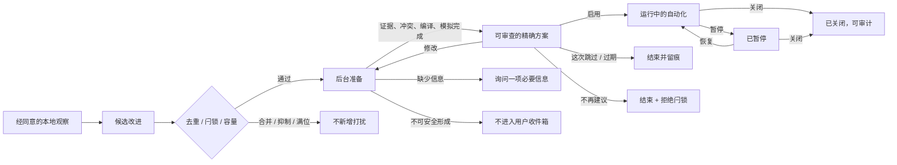

# 家庭建议与自动化启用：业务梳理

状态：**业务重审稿 — 技术架构暂停评审**

日期：2026-08-22

读者：产品、设计、家庭自动化、Agent Runtime、Hub、前端与安全评审者

## 结论

hob 不需要一个全局、固定七天、强制经过的“试运行阶段”。

当前代码里的七天试运行没有安装临时规则、没有实际动作、没有试用指标、没有结果报告，也没有
因为试用而产生的停止或回退。它只是在第一次批准后启动一个七天计时器，时间到了以后开放第二个
批准按钮。这是技术过渡状态，不是家庭用户能够理解和获得价值的业务能力。

推荐的业务主线更简单：

1. Agent 发现可能值得改变的长期行为。
2. Hub 在后台完成证据、冲突、权限、精确方案、编译和无写入模拟。
3. 家庭看到一份已经准备好的具体方案。
4. 家庭做一次准确决定：启用、修改、这次跳过、不再建议或稍后处理。
5. 启用后的自动化保持可见、可暂停、可关闭、可回退；系统持续观察实际结果，仅在出现问题时
   再打扰用户。

用户不需要先批准一个抽象方向，再等待系统准备，再批准一次。无副作用的内部准备由系统提前完成；
用户的注意力留给真正改变家庭行为的那一次决定。

如果系统缺少判断依据，它可以提出“收集更多证据”，但这是一项只读观察计划，不是自动化试运行。

## 七天试运行现在究竟是什么

当前实现的流程是：

```text
pending_review
  -> 用户批准
trial_active
  -> 七个自然日经过
enable_pending
  -> 用户再次批准
enabled
```

这个状态机看起来完整，实际缺少业务内容：

- `trial_active` 没有对应的临时自动化；
- 七天内没有调度或执行提案中的动作；
- 没有记录计划发生多少次、实际执行多少次；
- 没有记录用户拒绝、物理开关覆盖、失败或舒适度反馈；
- 七天结束只检查时间，不检查是否发生过任何有效样本；
- 最后的 `enabled` 仍与 `applicationStatus: not_available` 同时存在。

因此，它没有回答“试了什么”“结果怎样”“为什么可以长期使用”。一个无人居住的七天和每天发生
十次动作的七天，在当前实现里完全等价。

这套机制应从业务方案中删除。现有代码和界面属于待修正实现，不再作为未来设计依据。

## 我们真正要解决的家庭问题

hob 的核心价值不是生成更多规则，而是减少家庭成员反复调整设备和维护自动化的负担。

典型问题包括：

- 窗帘每天按固定时间开启，季节变化后经常太早或太晚；
- 空调自动化与真实作息不一致，家庭成员不断手动改回；
- 回家场景遗漏了某个房间，用户每晚都要补开一盏灯；
- 多个生态各有一条相似规则，产生重复动作或冲突；
- 现有传感器不足，系统无法判断光照、有人状态或空气质量。

这些问题往往不会以一次严重故障出现，而是以低频、重复、令人厌烦的小纠正出现。Agent 的价值
在于把分散事实整理成一份准确建议，并替用户完成大部分准备工作。

家庭用户最终关心四件事：

1. 为什么提出这件事；
2. 具体会改变什么；
3. 会不会影响安全或现有规则；
4. 开启以后怎样暂停、关闭和恢复原状。

业务流程围绕这四个问题展开，不围绕内部 Agent 阶段展开。

## 从窗帘问题看正确流程

用户说：

> 窗帘自动开启的时间有时太早、有时太晚，有什么建议？

### 第一步：先回答

hob 先说明已知事实、可能原因和缺失信息。例如：当前规则使用固定时间；最近存在多次手动关闭；
系统还不知道窗外亮度或房间作息。这个阶段是普通对话，不创建工作流来证明 Agent 做过分析。

### 第二步：系统自己准备

如果已有足够证据，Hub 可以在后台形成精确方案，例如：

> 日出后且卧室亮度达到阈值时，在 07:00–08:30 之间开帘；检测到有人仍在睡眠场景时跳过；保留
> 现有墙面开关优先级。

系统同时完成：

- 检查当前 HA/小米规则是否重复或冲突；
- 确认目标设备和能力绑定；
- 检查风险、权限和回退条件；
- 编译成中立 Artifact；
- 生成无写入模拟和预期变化；
- 准备关闭与恢复原规则的方式。

这些工作不会改变设备，不值得消耗一次家庭批准。

### 第三步：家庭看精确方案并决定

用户看到：

- 为什么建议；
- 会在什么条件下开帘；
- 哪些现有规则会被替代或暂停；
- 哪些情况会跳过；
- 风险和当前未知；
- 如何立即暂停和恢复。

用户可以选择：

- **启用这条自动化；**
- **告诉 hob 怎样修改；**
- **这次跳过；**
- **不再建议调整这件事；**
- **稍后处理。**

这一次决定有明确后果，因此值得认证、权限检查和审计。

### 第四步：启用后持续可控

启用成功后，产品显示这条自动化正在工作、最近一次运行结果、谁创建了它、当前版本以及暂停和
关闭入口。物理开关和人工操作继续拥有即时优先级。

系统可以在后台判断规则是否经常失败、被手动覆盖或从未触发。只有当结果偏离预期时，hob 才再次
提出修改建议。正常工作的自动化不需要七天后强迫用户完成一次复盘。

## 六种家庭对象

| 用户情境 | 业务对象 | 正确动作 | 是否进入自动化启用 |
| --- | --- | --- | --- |
| “为什么窗帘开得太晚” | 回答/解释 | 直接回答，标出事实与未知 | 否 |
| “在多媒体室播放爵士乐” | 一次性动作 | 立即执行或按风险请求短 TTL 放行 | 否 |
| “厨房漏水”“门未锁” | 安全告警 | 穿透全部视图并立即处置 | 否 |
| “今后按亮度和作息开帘” | 自动化建议 | 后台准备精确方案，再请求启用 | 是 |
| “增加光照传感器会更准确” | 硬件/能力建议 | 解释收益、成本和替代方案 | 否 |
| “把这个设备和另一个生态中的设备合并” | 系统治理 | 管理员在 Identity/Authority owner 中处理 | 否 |

这些对象可以出现在同一段对话里，但不共享生命周期。

### 一次性动作

一次性动作只讨论这一次执行。低风险、人在场、可撤销的动作可以直接执行并提供短暂撤销；高影响
动作进入带 TTL 的运行时确认。运行时拒绝只结束这一次，不产生长期拒绝闩锁。

### 安全告警

漏水、烟雾和门锁等安全事实拥有独立 Host 安全层。它们不进入建议容量，不允许 snooze 掩盖风险。

### 自动化建议

自动化建议会持续改变未来行为。系统准备完成后，家庭基于精确方案做一次启用决定。它使用证据、
去重、冲突检查、自然过期、拒绝闩锁、权限和审计。

### 硬件与家庭能力建议

硬件建议不伪装成自动化。用户可以查看推荐原因、可以先用什么验证、预计改善多少以及购买后的
接入方式。产品尚未提供采购或设备计划功能时，“有帮助”只是反馈，不暗示系统会自动完成后续。

### 系统治理

Identity link、capability binding 和 action authority binding 是系统配置决定。它们需要管理员和
精确目标，由各自 Hub owner 负责，不进入普通“给家的建议”列表。

## 推荐的自动化业务流程



这条主线只有一个用户批准：从已经准备好的精确方案到启用。

## 为什么系统应该先准备，再打扰用户

### 用户决定应该具体

“这个方向听起来不错”不是执行授权。只有当触发条件、目标设备、动作、冲突、权限和回退都明确时，
用户才知道自己批准了什么。

### 安全准备不消耗家庭权力

读取本地世界、检查冲突、编译中立 Artifact 和执行无写入模拟都不会控制设备。系统应主动完成这些
工作，而不是把内部计算包装成一次用户同意。

### 减少通知和半成品

准备失败、没有绑定、冲突无法解决或证据明显不足的候选，可以在打扰家庭之前被合并、抑制或丢弃。
用户看到的建议数量更少，质量更高。

### 一个按钮对应一个结果

“启用”创建可运行的持久行为；“修改”形成新版本；“这次跳过”结束当前建议；“不再建议”建立
闩锁。每个按钮都能用一句话解释后果。

## 证据不足时怎么办

证据不足不等于需要试运行。系统有三种正常出口。

### 1. 直接说明未知

用户只是问原因时，hob 可以回答“目前无法判断阴天亮度是否是原因”，并说明缺什么。诚实回答
优于创建一个不完整自动化。

### 2. 建议补充硬件

如果缺少光照、有人状态、空气质量或能耗信息，hob 可以建议硬件，并先说明现有设备能否替代验证。

### 3. 发起只读观察计划

当现有传感器已经具备，但样本不足时，可以创建一个明确的观察计划：

- 目标：验证哪一个问题；
- 数据：读取哪些中立能力；
- 结束条件：例如三个工作日早晨、十次手动覆盖或达到最小样本数；
- 上限：最长观察时间和数据预算；
- 结果：形成结论、继续等待或放弃；
- 控制：用户可以随时停止。

观察计划只读取数据，不执行动作。它的结束条件由问题决定，可以是事件数量、工作日覆盖或季节性
窗口。全局固定七天无法适配门锁、窗帘、空调、影音和能耗等不同问题。

## 启用后的治理

删除试运行不等于降低安全标准。安全来自精确方案、权限、可撤销性和持续可控，而不是等待七天。

### 低风险、可逆自动化

例如灯光、窗帘和普通媒体行为，在完成冲突检查、风险检查、模拟和精确批准后可以启用。界面持续
提供暂停、关闭和恢复原配置。

### 中等影响自动化

需要管理员批准，明确影响范围和回退。必要时首次实际动作可以发送通知，但不额外创造通用试用
状态。

### 高影响行为

门锁、安防、危险设备或 policy 不确定的行为保持 fail-closed。系统可以拒绝将其做成无人监督的
持久自动化，或让每次具体动作进入独立运行时确认。七天试运行无法把高风险行为变成低风险行为。

### 物理操作

物理开关和家庭成员的即时操作拥有优先权。频繁人工覆盖会成为后续调整建议的证据，不会被系统
解释成用户操作错误。

## 用户面对的界面

一张自动化建议卡只需要表达：

- 标题与预期价值；
- 证据和未知；
- 精确触发条件与动作；
- 与现有规则的关系；
- 风险、权限和影响空间；
- 暂停、关闭与恢复方式；
- `启用`、`修改`、`这次跳过`、`不再建议`、`稍后处理`。

启用后，这张卡转入自动化/活动视图，而不是继续留在建议收件箱。运行视图显示状态、最近活动、
人工覆盖、错误、暂停、关闭和版本历史。

准备尚未完成的候选默认不占用用户界面。需要一项用户信息时，hob 在原对话或一个明确问题中询问，
而不是展示一张带多个技术阶段的半成品卡。

## 注意力容量与拒绝承诺

最多五条未决家庭建议仍然合理，因为它限制的是用户注意力，而不是后台候选数量。

- snooze 继续占用五个位置；
- 同一 `dedupKey` 的新证据合并到现有建议；
- “这次跳过”只结束当前建议；
- “不再建议”创建持久闩锁并明确回应；
- 容量满后，Agent 降低提案输出并反思质量；
- 一次性动作、安全告警和系统治理不占这五个位置。

后台正在准备但尚未展示的候选需要独立、很小的资源上限，防止模型和编译工作无界增长。它不是
用户收件箱容量。

## 当前系统的真实位置

### 已经具备，可以保留

- 中立 HomeWorld 与 HA/小米桥；
- DSH/Cordis Agent loop 与受治理工具；
- 本地证据、新鲜度、历史缺口和规则冲突检查；
- 提案去重、五条容量、自然过期、snooze 和拒绝闩锁；
- Artifact、权限、风险、编译和无写入 dry-run；
- preparation job 的持久化与显式重试；
- 独立的运行时确认、安全告警、一次性控制和媒体路径；
- 本地认证、权限与审计基础。

### 需要删除或重新设计

- 第一次“确认方向”才能开始无副作用准备；
- `trial_active`、固定七天计时和 `advanceProposalTrial`；
- 没有真实应用能力却出现的 `enable_pending`、`enabled`；
- “确认方向—试运行—长期使用”的固定三步 stepper；
- 自动化草案和硬件/家庭洞察共用一个批准文案；
- Proposal envelope 中属于 Identity/Authority governance 的 kind。

### 完整产品闭环还缺少

- 将准备好的中立 Artifact 转成目标平台可运行自动化的受治理部署路径；
- 启用结果校验和明确失败状态；
- 暂停、关闭、恢复原配置和版本回退；
- 活动归因与人工覆盖反馈；
- 运行异常、依赖失联和规则冲突变化后的重新评估。

当前 Phase 0 能证明 Agent 可以生成有证据、可模拟的方案，但还不是用户能够启用和管理自动化的
完整产品闭环。下一项产品能力应优先补齐真实启用、暂停、关闭和回退，而不是继续丰富过渡状态。

## 对 Proposal Store 的业务要求

业务通过评审后，技术架构需要重新推导。Proposal Store 至少要支持：

- 已准备、等待用户决定的家庭建议；
- 精确方案版本与预期 revision；
- `enable`、`modify`、`reject_once`、`do_not_suggest`、`snooze` 和自然过期；
- 决定、actor、证据、方案版本和审计的一致性；
- 自动化建议与硬件/家庭洞察的不同动作；
- 与 Artifact 和未来 Deployment owner 的精确引用；
- 同一事务中的用户决定及其必要持久副作用；
- 前端组合 Proposal、Artifact 和 Deployment 事实的只读投影。

Proposal Store 不拥有设备执行、桥原生 payload、Identity/Authority 应用、运行时确认和安全告警。

准备任务何时创建、是否与 Proposal 共库、启用与部署怎样保证一致性，需要在这份业务方案通过后
重新设计。上一版技术稿中的结论不自动继承。

## 成功指标

健康的产品不追求更高批准率，而追求更少打扰和更长期有效的结果：

- 用户看到的建议中，有多少已经具备完整方案和可读模拟；
- 同类建议是否正确合并，满位时是否停止打扰；
- 用户能否准确理解启用、修改、跳过和不再建议的后果；
- 启用是否成功，并能否立即暂停、关闭和恢复；
- 自动化启用后是否频繁失败或被人工覆盖；
- 被拒绝和闩锁的主题是否真正停止出现；
- 硬件建议是否帮助用户改善能力，而不是制造购买压力；
- 运行一段时间后，家庭是否保留这条行为。

自动化被启用后很快关闭，比单纯的“批准率低”更能说明方案质量问题。Agent 的目标是减少家庭
反复维护，而不是增加启用数字。

## 本次业务评审要确认的决策

1. 删除全局固定七天试运行及其状态机。
2. 系统在展示建议前完成所有无副作用准备。
3. 家庭只对已经明确的自动化做一次启用决定。
4. 证据不足时使用回答、硬件建议或只读观察计划，不使用试运行占位。
5. 启用后的安全依靠权限、精确范围、暂停、关闭、回退和必要的逐次确认。
6. 自动化建议、硬件建议、一次性动作、安全告警和系统治理保持独立业务语义。
7. 五条容量继续限制用户可见的未决家庭建议；后台准备拥有独立资源上限。
8. 下一项完整产品能力优先建设真实部署、状态验证、暂停、关闭和回退。
9. Proposal Store 技术架构在这些决策通过后重新设计。

## 评审顺序

本轮只评审本文的业务对象、用户决定和产品闭环。

[`proposal-store-architecture.md`](./proposal-store-architecture.md) 已暂停评审。业务决策通过后，技术稿
将从本文件重新推导状态、事务、owner、端口和迁移方案，避免让现有代码结构反过来定义产品。
