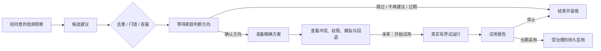

# 家庭提案治理：业务背景与产品事实

状态：**提议稿 — Proposal Store 架构评审的业务开篇**

日期：2026-08-22

读者：产品、设计、家庭自动化、Agent Runtime、Hub、前端与安全评审者

## 先说结论

hob 的目标不是替家庭生成更多自动化，而是帮助家庭形成更合适、可理解、可撤回的长期行为。

家庭提案解决的是一个具体问题：Agent 观察到一种可能值得长期改变的家庭行为时，怎样把它变成
一条有证据、有边界、有人决定、能够继续验证的建议，同时守住家庭对设备和规则的最终控制权。

这项业务需要 Proposal Store，因为一条长期建议会跨越多次对话、多个家庭成员、服务重启和数天
评估。它需要记住证据、家庭决定、拒绝承诺、准备结果和完整审计。普通聊天记录、一次性动作队列
和模型上下文都无法承担这份责任。

Proposal Store 也有清晰边界：它管理“家庭是否愿意继续考虑这项长期改变”，并不直接控制设备，
也不把方向批准解释成规则已经安装。

## 我们在做什么产品

hob 是一个 Agent-first 的家庭中枢。Home Assistant、小米和未来其他生态负责连接设备与既有规则；
Hub 把它们整理成中立的家庭世界；Agent 基于家庭明确允许的观察范围，帮助用户理解现状、发现
问题并提出改进方向。

用户购买的价值不是一个更漂亮的设备后台，而是三件事：

1. **少操心。** 系统能发现“每天都在手动纠正”的规律，并在合适的时候提出一次有用建议。
2. **更合心意。** 家庭可以解释、纠正、试用和撤回，自动化逐渐贴近真实生活。
3. **保持掌控。** Agent 可以分析和准备，家庭决定长期行为；物理操作、安全策略和权限边界始终
   拥有明确优先级。

因此，提案不是 Agent 的产出展示，而是一份家庭与 Agent 之间的长期行为协商记录。

## 一个贯穿场景：窗帘时间不合心意

用户说：

> 我觉得窗帘自动开启的时间不太合心意，有时太早，有时太晚，有什么建议？

理想的产品过程分为四层。

### 1. 先回答问题

hob 先结合当前家庭事实说明可能原因，例如日出时间变化、固定时间规则、房间朝向、阴天亮度、
作息差异或现有 HA 自动化。事实、推测和未知分别呈现。用户此时只是在寻求建议，系统不需要创建
一条持久提案。

### 2. 找出缺失的信息

如果家庭只有固定时刻，没有照度、窗外亮度或在家状态，hob 可以说明哪些信息会提高判断质量，
并建议先利用现有设备验证，或在确有价值时补充一个光照传感器。硬件建议保持可选，说明预期收益
和低成本验证方式。

### 3. 形成长期行为方向

当建议具体到“今后根据日出、亮度和家庭作息，在一个时间窗口内开帘”，它开始影响未来持续
行为，此时才成为提案。提案必须说明：

- 为什么现在提出；
- 使用了哪些家庭证据；
- 哪些信息仍然未知；
- 与现有 HA/小米规则是否重复或冲突；
- 预计改变什么；
- 怎样回退；
- 需要哪些权限、设备或硬件。

### 4. 家庭分阶段决定

第一次决定只表示“这个方向值得继续准备”。Hub 随后生成中立制品、检查权限和冲突、编译并
形成不写设备的模拟结果。具备真实试运行能力后，家庭再开始一个有边界的试用；试用结束后看到
实际结果，最后决定是否长期采用。

这四层把“好建议”与“擅自改家”分开，也让用户每次只面对当下真正需要做的决定。

## 四种容易混淆的家庭对象

| 用户情境 | 业务对象 | 用户在决定什么 | 典型时效 |
| --- | --- | --- | --- |
| “在多媒体室放一首爵士乐” | 一次性动作 | 现在是否执行这个具体动作 | 秒到分钟 |
| “门没锁”“厨房漏水” | 安全告警 | 现在怎样处置风险 | 立即 |
| “窗帘今后按亮度和作息开启” | 持久提案 | 是否继续准备和采用长期行为 | 数天到数周 |
| “增加一个光照传感器会让开帘更准确” | 家庭改进建议 | 是否值得增加能力或硬件 | 无紧迫感 |

一次性动作进入 typed Hub action 和运行时确认；安全告警进入 Host 安全层；长期行为进入 Proposal
治理；硬件建议可以作为 `household-insight` 提案保留，但它不会假装自己是一条可安装的自动化。

这四种对象可以出现在同一段对话中，生命周期、权限、过期方式和拒绝后果各自独立。

## 提案的业务定义

一条提案是：

> 基于有限家庭证据，对未来持续行为或家庭能力提出的、等待家庭决定的有界建议。

它具备六个业务特征：

1. **面向未来。** 讨论的是重复行为、长期偏好、设备关系或家庭能力。
2. **带着证据。** 用户能够看见建议依据、数据新鲜度、缺口和冲突。
3. **允许不确定。** Agent 明确写出未知，不把推测包装成家庭事实。
4. **由家庭决定。** Agent 负责发现和准备，家庭负责方向与长期采用。
5. **可以结束。** 拒绝、自然过期和“不再建议”都有明确且不同的含义。
6. **能够追溯。** 重启或换设备后，家庭仍能知道谁在何时基于什么做了什么决定。

以下内容本身不是提案：

- 一段解释或普通建议；
- 一个等待几秒放行的设备动作；
- 一个必须穿透全部界面的安全告警；
- 一份已经安装或正在执行的自动化；
- Agent 的隐藏推理、草稿或内部任务队列。

### 当前产品中的两类家庭提案

| 类型 | 用户接受时表达什么 | 当前系统后续动作 |
| --- | --- | --- |
| 自动化方向 `automation-draft` | “这个长期行为方向值得继续准备” | 原子创建 preparation job，生成 Artifact 与模拟结果 |
| 家庭洞察 `household-insight` | “这条分析、硬件建议或偏好判断有价值” | 保存接受反馈，用于校准；当前不写家庭知识或设备行为 |

身份合并、能力绑定和动作权限绑定属于 Hub 系统治理。它们需要管理员身份、精确目标和各自 owner
的应用契约，不进入普通家庭建议，也不占用“给家的建议”五个注意力位置。当前 Proposal envelope
虽然列出了这些 kind，实际生产路径仍由 Identity/Authority governance 独立持有；v2 将把这项边界
落实到类型系统。

两类家庭提案共享证据、去重、容量、暂缓、拒绝和审计纪律，但接受结果不同。界面为自动化显示
“确认方向，开始准备”，为家庭洞察显示“这条建议有帮助”。一个通用的“批准”文案无法准确表达
这两个决定。

## 为什么需要主动提案

家庭问题经常以低频、重复、分散的方式出现。单次对话看不出规律：窗帘一周被手动调整三次、
空调每天在类似时段被改回、影音室的播放设备经常选错。持续但低频的本地观察，能够把这些碎片
整理成一次值得讨论的建议。

这是 hob 相对传统仪表盘和被动语音助手的核心差异。传统界面等待用户知道应该改哪条规则；hob
可以先发现可能的问题，再用证据邀请家庭判断。

主动能力同时带来注意力风险。Agent 如果不断堆建议，很快会变成另一种通知噪声。因此业务上
采用三条固定纪律：

- **先同意方向。** 方向批准只允许系统继续准备。
- **尊重拒绝。** “不再建议这件事”形成家庭可见的长期承诺。
- **限制积压。** 未决提案最多五条，snooze 仍然占用位置。

容量满时，业务目标是降低输出并反思提案质量，而不是寻找另一个通知入口。

## 用户究竟在做哪些决定

### 决定 A：这条建议值得继续吗

用户可以：

- **确认方向：** 允许 Hub 为这个方向准备精确方案；
- **这次跳过：** 结束当前提案，未来新证据仍可形成新提案；
- **不再建议这件事：** 结束当前提案并建立 `dedupKey` 拒绝闩锁；
- **暂缓：** 延后决定，提案继续占用容量；
- **等待自然过期：** 十四天后关闭，不产生拒绝闩锁。

对于自动化草案，“接受”记录为 `automation_direction_approved`；对于家庭洞察，记录为
`insight_accepted`。二者可以共享终态 `accepted`，后续副作用由接受类型严格决定。家庭洞察不会
创建自动化准备任务。

### 决定 B：准备出的方案是否适合试用

这个决定必须建立在精确制品、权限检查、冲突结果、风险、模拟和回退计划之上。家庭看到的是
“将试什么、什么时候可能发生、每次是否需要确认、怎样停止”，而不是一段抽象模型描述。

### 决定 C：真实试用后是否长期采用

这个决定需要真实试用报告，包括计划机会、实际执行、被拒绝或跳过的动作、物理覆盖、错误、
舒适度反馈和回退结果。仅仅经过七个自然日并不能证明发生过试用。

三个决定可以属于一条连续产品旅程，但它们不能压缩成一个“批准”按钮。

### 与既有“双同意”产品决策的关系

这项修正保留“双同意”原则：家庭先确认方向，真实试用后再决定长期采用。它修正的是两个决定
之间缺失的业务事实。

当前系统在第一次同意后能够准备方案和模拟，尚不能开展真实试用。因此第二次同意继续作为产品
目标，等试运行、结果报告、暂停和回退形成完整闭环后进入运行状态。这个调整让 consent-first
更加可信，而不是取消第二次同意。

## 当前系统已经具备的真实能力

截至 2026-08-22，仓库已经具备：

- Home Assistant 与小米桥接后的中立家庭世界；
- DSH/Cordis Agent loop 与受治理的家庭工具；
- 本地证据引用、水位、新鲜度、历史缺口和现有规则冲突检查；
- 最多五条未决提案、十四天自然过期、两次 snooze；
- `reject_once` 与 `do_not_suggest` 两种拒绝语义及持久闩锁审计；
- 自动化方向接受与 Artifact preparation job 的原子提交；
- Artifact、证据、权限候选、风险、编译和无写入 dry-run；
- 本地认证的 review center 与准备状态展示；
- 独立的运行时确认、安全告警、一次性控制和媒体控制路径。

一份已记录的真实家庭中立快照包含 75 个设备、540 个可接受当前状态、6 个空间和 12 条可见
既有规则。仓库只记录这些汇总，不记录家庭名称、设备名称、状态值和凭据。这个规模已经足以说明
去重、冲突检查、证据新鲜度和容量治理属于首发要求。

## 当前系统尚未具备的能力

当前产品还没有：

- 把准备完成的 Artifact 安装为临时试运行规则；
- 调度并执行七天真实试运行；
- 汇总试运行机会、实际动作、拒绝、物理覆盖与家庭反馈；
- 根据试用报告发起第二次长期采用决定；
- 把长期决定应用为可运行、可暂停、可回退的持久自动化。

这意味着当前代码在方向批准后立即写入 `trial_active`，并只依据七个自然日把状态推进到
`enable_pending`，超前于产品事实。`applicationStatus` 同时保持 `not_available`，进一步证明系统
记录的是时间经过，而不是真实试用。

架构评审需要修正这项语义：方向批准后进入“方案准备”，准备成功后显示模拟结果。真实试运行
对象和状态只在试运行执行、观测与停止能力一起进入产品时建立。在此之前，界面明确显示“方案已
准备，试运行能力尚未开放”，而不是展示正在试运行。

这项修正通过评审后，需要同步更新 `design-review-decision-log.md` 中“双同意”的阶段说明、
`v4-product-implementation.md` 的 Proposal 投影、Review Center 的三步 stepper 和对应测试。
双同意仍是目标体验，当前界面从“试运行中”改为“方案准备/模拟完成”。评审通过前，本文只记录
提议，不改生产行为。

## 目标业务旅程

当前 Phase 0 的业务闭环到 `ReviewPlan`：家庭能够收到有依据的建议，决定方向，并看到一个经过
治理、可审查、没有写设备的准备结果。`Trial`、`Report` 和 `Deployment` 是后续业务能力，进入
产品时需要自己的契约、状态机、权限、停止与回退验收。

## 为什么系统需要这样设计

### 1. 家庭信任跨越多次会话

提案可能在手机上出现、在平板上暂缓、由管理员在另一台设备上批准，并在服务重启后继续准备。
因此决定和审计必须持久化，模型记忆不能成为业务事实来源。

### 2. 一个家庭决定会产生多个原子后果

“不再建议”必须同时关闭提案、建立闩锁并写审计；方向批准必须同时保存决定并创建准备任务。
任何一半成功都会违背用户刚刚看到的承诺，所以一个事务所有者负责这些原子边界。

### 3. 插件扩展能力，Hub 固定治理

未来开发者可以提供新的桥、提案来源、证据能力和界面布局。家庭对容量、拒绝、审批、审计和
权限的期待必须在任何插件下保持一致。插件扩展“能够建议什么”，Hub 决定“建议怎样成为家庭
事实与长期行为”。

### 4. UI 需要组合多个事实来源

用户看到的是一条连续旅程，系统内部则有提案决定、准备任务、Artifact、运行时确认、安全告警
和未来试运行等多个对象。前端通过稳定投影组合它们，不把所有状态塞进 Proposal 一张表。

### 5. 失败与重启是正常业务状态

模型调用、桥连接、编译和 dry-run 都可能中断。家庭需要看到“准备失败，可重试”，而不是卡片
消失或重复生成。持久任务与版本检查让恢复过程可见、可控、不会重复执行。

### 6. 家庭数据默认留在本地

提案包含生活规律、空间、设备与偏好。它默认保存在本地私有文件中；模型和插件只获得完成当前
任务所需的中立、有限投影。

## 业务状态与系统责任

| 业务阶段 | 当前是否真实可用 | 系统 owner | 用户界面必须说实话 |
| --- | --- | --- | --- |
| 候选准入 | 是 | Proposal governance | 合并、抑制或容量已满 |
| 等待方向决定 | 是 | Proposal Store | 证据、未知、冲突、过期和三种决定 |
| 方案准备 | 是 | Proposal Store + Artifact pipeline | 排队、准备中、失败、模拟完成 |
| 真实试运行 | 否 | 后续 Trial owner + runtime confirmation | 当前显示“尚未开放” |
| 试用报告 | 否 | 后续 Trial evidence owner | 以实际事件和反馈为准 |
| 长期启用 | 否 | 后续 deployment/authority owner | 当前不显示“已启用” |

这张表是技术命名和 UI 文案的事实基线。系统拥有实际能力之后，才能增加对应的 active、completed
或 enabled 状态。

## 成功指标

这项业务不以“批准率越高越好”为目标。健康指标包括：

- 用户明确同意主动观察后，首份提案能否按时到达；
- 提案是否有足够证据并准确表达未知；
- 相同建议是否被合并，容量满时是否停止新增；
- 用户能否理解“这次跳过”与“不再建议”的差别；
- 方向批准后，准备是否稳定完成并给出可读结果；
- 被拒绝的方向是否真正停止打扰；
- 用户纠正和物理覆盖是否降低相同问题再次发生；
- 后续真实试运行中，有多少计划机会实际发生、被拒绝、被覆盖或失败；
- 长期采用后，家庭是否继续保留行为，还是很快暂停或回退。

接受率、关闭率、闩锁率、提案积压时间和人工覆盖率需要一起看。高接受率伴随高回退率，说明系统
把决定做得太轻；低接受率伴随高闩锁率，说明 Agent 没有理解家庭价值。

## 本次架构评审需要回答的问题

评审 Proposal Store 的模块和事务之前，请先确认这些业务判断：

1. 提案只承载未来持续行为和家庭能力建议；一次性动作与安全告警继续由独立 owner 管理。
2. 自动化方向接受的业务结果是“开始准备精确方案”，不是“开始试运行”；家庭洞察接受只记录
   价值反馈。
3. 当前 Phase 0 在可审查的 Artifact 与无写入模拟结果处闭环。
4. 真实试运行必须绑定可运行制品、明确权限、停止方式、实际事件和结果报告。
5. 七个自然日经过本身不构成试运行完成。
6. 长期采用状态只在系统拥有真实部署、暂停和回退能力后进入产品。
7. 插件扩展提案来源与表现形式，Hub 固定家庭治理语义。
8. Proposal Store 保持一个事务所有者，前端通过投影组合 Proposal、Job 与 Artifact 事实。
9. Identity、Capability 与 Authority 治理继续由各自 Hub owner 管理，不伪装成家庭提案 kind。

这些判断通过后，技术评审才能判断模块边界是否服务真实业务，而不是只判断代码是否拆得整齐。

## 与技术评审稿的关系

本文件回答“为什么存在 Proposal Store、用户在决定什么、当前系统真实做到哪里”。

[`proposal-store-architecture.md`](./proposal-store-architecture.md) 回答“这些业务承诺如何落实为契约、
状态机、事务、持久化、扩展端口和迁移步骤”。技术稿中的命名、状态与验收门槛均以本文件为上游
事实；两份文档作为同一个评审包提交。
