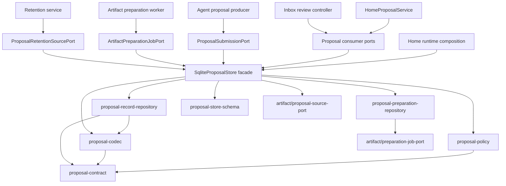
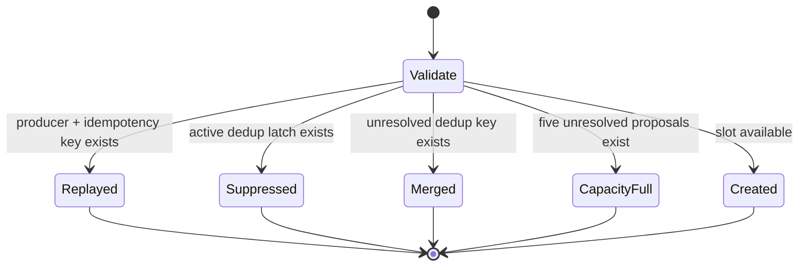
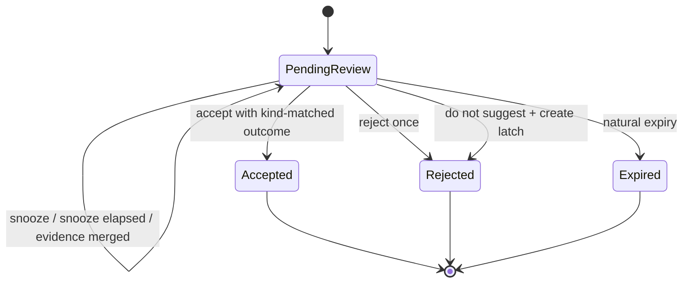
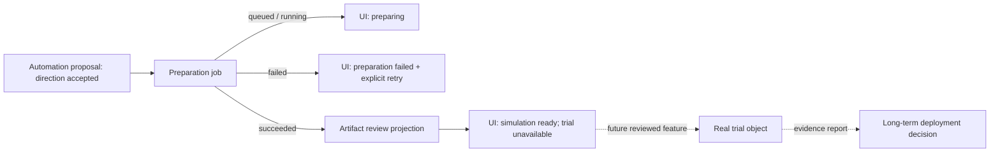
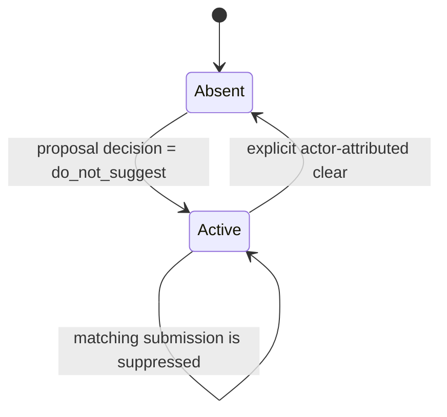
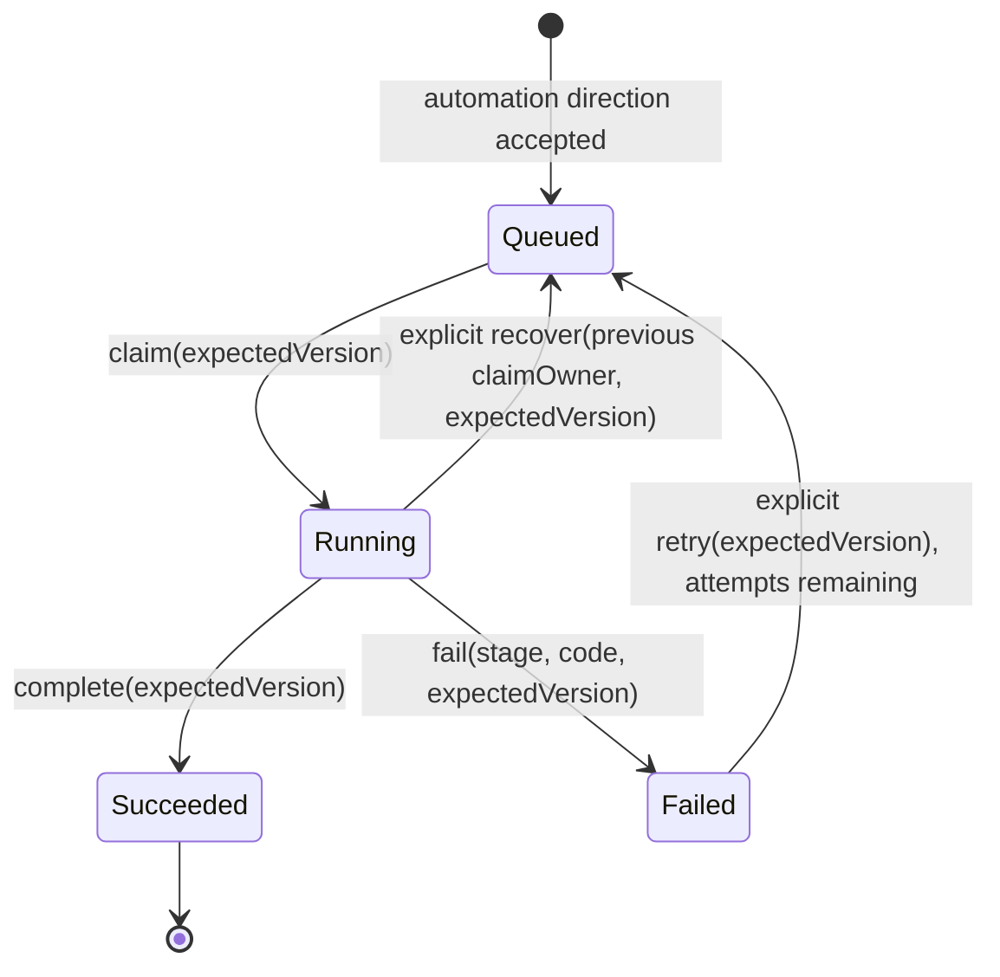

# Proposal Store architecture review

Status: **Paused — business lifecycle is under review; do not implement this draft**

Scope: Hub proposal governance and direction-approved proposal preparation queue

Out of scope: runtime confirmations, Artifact Registry internals, automation execution

Business prerequisite: read
[`proposal-governance-business-context.md`](./proposal-governance-business-context.md)
first. It defines the household problem, current product reality, target journey,
and the difference between direction approval, preparation, trial, and deployment.

The business review now proposes prepare-first, one exact enable decision, and no
universal trial state. The technical sections below are retained only as the prior
draft. Their commands, states, transaction placement, and migration decisions will
be rewritten after the business review is accepted.

## Business correction carried into this design

The current implementation marks a proposal `trial_active` immediately after the
household approves its direction and advances it after seven calendar days. The
product currently prepares an Artifact and a no-write dry-run; it has no temporary
rule installation, trial execution, trial event collection, trial report, or
persistent deployment path.

This architecture therefore replaces speculative trial and enablement state with
the states the product can prove:

- accepting an automation direction closes the proposal review decision and
  atomically queues preparation when it contains an eligible artifact candidate;
- accepting a household insight records useful feedback without creating an
  automation preparation job;
- preparation status comes from the durable preparation job and Artifact owners;
- a prepared proposal can show its exact simulation and the honest product status
  “trial unavailable”;
- trial and long-term deployment enter the contract through a later reviewed
  feature that supplies execution, observation, stop, report, and rollback together.

The structural extraction and this semantic correction land as separate commits,
both before the first release.

## Decision summary

Refactor the current `proposal-store.ts` now, before the first release. Preserve one
public SQLite facade and one transaction owner while extracting stable contracts,
pure governance rules, persistence codecs, and borrowed repositories.

The design makes four commitments:

1. **Hub owns proposal governance.** Producers may suggest household behavior;
   plugins and agents cannot add governance states or bypass review.
2. **One facade owns every atomic boundary.** `SqliteProposalStore` opens and closes
   the database, starts and commits transactions, and coordinates proposal, latch,
   audit, and preparation-job writes.
3. **Policies are pure and exhaustive.** Proposal, snooze, latch, and job
   transitions are calculated without SQLite, hidden clocks, or generated IDs.
4. **Consumers depend on narrow ports.** Agent producers, review UI, artifact
   preparation, and retention each receive only the operations they need.

This is a structural and semantic design. No production behavior changes are part
of this review document. The implementation plan separates behavior-preserving
extraction from the proposed pre-release contract cleanup.

## Why this should happen now

The current store is 2,337 lines and combines five durable tables, input and row
validation, governance policy, file permissions, roughly two dozen public methods,
and dozens of transaction statements. Its size is a signal; the architectural risk
is the concentration of unrelated reasons to change:

- adding a proposal producer changes proposal input;
- changing household review changes the lifecycle;
- changing persistence changes row decoding and migration;
- changing artifact preparation changes the internal job queue;
- changing retention changes privileged snapshot access;
- changing product analytics changes aggregate queries.

The project has not shipped, so duplicate public APIs and misleading names can be
removed before third-party code depends on them. The refactor still preserves local
development databases through a deterministic migration rather than treating
pre-release as permission to discard household data.

## Domain boundary

Proposal governance and runtime confirmation remain separate domains.

| Concern | Proposal Store | Runtime Confirmation owner |
| --- | --- | --- |
| Meaning | Suggest a persistent household behavior | Ask permission for one pending action |
| Lifetime | Up to 14 days; snooze remains in capacity | Short visible TTL; expiry fails closed |
| Rejection | `reject_once` or durable `do_not_suggest` latch | Reject this action attempt |
| Capacity | At most five unresolved proposals, including snoozed cards | Independent safety queue and limits |
| Approval result | Starts governed proposal preparation | Authorizes the exact bounded action |
| Expiry | Closes an unattended suggestion | Cancels execution and leaves an audit event |

The Proposal Store never accepts a confirmation ID, confirmation TTL, device action,
or execution authority. Runtime rejection can never create a proposal dedup latch.

## Ownership and invariants

### Hub-owned invariants

- Every proposal starts as `pending_review`.
- A pending proposal reaches exactly one terminal review status: `accepted`,
  `rejected`, or `expired`.
- An accepted proposal carries exactly one kind-matched acceptance record:
  `automation_direction_approved` or `insight_accepted`.
- Snoozing keeps `pending_review` and occupies one of the five proposal slots.
- `reject_once` leaves the behavior identity available for future evidence.
- `do_not_suggest` creates one durable latch and one latch audit event atomically
  with proposal rejection.
- Clearing a latch is explicit, actor-attributed, and audited.
- Automation-direction acceptance does not apply an automation or grant device
  execution authority.
- Acceptance of an eligible automation direction and creation of its preparation job
  commit in the same transaction.
- Proposal revision checks guard every user-visible mutation.
- Expiry and preparation retries use an explicit injected time or
  expected version; no state transition depends on a hidden timer callback.
- Corrupt persisted combinations fail closed with `corrupt_store`.

### Extension boundary

Agent and plugin producers may contribute:

- a proposal through the typed submission port;
- bounded evidence, rationale, provenance, and a neutral artifact candidate;
- a producer-specific `intent.type` inside the existing neutral envelope;
- presentation through a Host-governed layout API.

They do not receive:

- SQLite, repository, transaction, latch, or preparation-job handles;
- permission to define new review decisions or preparation states;
- permission to enlarge proposal capacity or expiry;
- permission to treat proposal approval as execution approval;
- ecosystem-native payload access across the neutral Hub boundary.

Proposal v2 contains two closed household kinds: `automation-draft` and
`household-insight`. Identity linking, capability binding, and action-authority
binding remain in their existing Hub governance owners and administrator surfaces;
they are system configuration decisions, not household suggestions. Adding a new
household kind is a versioned Hub contract decision because each kind changes review,
preparation, and UI semantics.

## Target modules

All modules remain under `packages/hub/src/home/` unless an existing Artifact-owned
port is named.

These proposal ports stay inside Hub rather than moving to the root `contracts`
package. Root contracts define the neutral bridge boundary that adapters may cross;
proposal governance is a Hub product-domain boundary and carries no ecosystem
payload or future adapter process contract.

| Module | Owns | Explicitly excludes |
| --- | --- | --- |
| `proposal-contract.ts` | Public domain types, commands, results, errors, constants, and narrow consumer ports | Zod schemas, SQLite rows, SQL, filesystem work |
| `proposal-schema.ts` | Zod input/envelope schemas and cross-field validation | Transactions, state transitions, service callbacks |
| `proposal-policy.ts` | Pure admission and transition decisions; state-machine guards; transition plans | SQLite, current time lookup, ID generation, Cordis |
| `proposal-codec.ts` | Row shapes, JSON encoding/decoding, legacy normalization, corruption mapping | SQL execution, policy decisions |
| `proposal-store-schema.ts` | Ordered SQLite schema migrations over a borrowed database | Database ownership, commands, business rules |
| `proposal-record-repository.ts` | Proposal, idempotency alias, latch, latch-audit, and aggregate SQL over a borrowed database | `BEGIN`, `COMMIT`, `ROLLBACK`, `close`, policy |
| `proposal-preparation-repository.ts` | Preparation-job SQL and compare-and-set persistence over a borrowed database | Job policy, transactions, artifact production |
| `proposal-store.ts` | Public facade, database/file lifecycle, transaction orchestration, clocks/IDs, privileged synchronous projections | Inline Zod object definitions and row decoding |

The existing Artifact-owned contracts keep their authority:

- the current `artifact/proposal-source-port.ts` owns the exact proposal-source
  projection consumed by artifact production. Contract cleanup renames it and its
  exported type to “direction-approved proposal source”.
- `artifact/preparation-job-port.ts` owns the worker-facing job contract.
- Artifact Registry owns artifact revisions, evidence, compilation, dry-run results,
  risk, authority, and artifact audit.

The preparation-job table stays in the proposal database because
automation-direction acceptance and durable queue insertion form one atomic
operation. Co-location does not transfer artifact ownership to the Proposal Store.

### Dependency direction



The facade is the only node allowed to own `DatabaseSync`, transaction statements,
private-file enforcement, the clock, and the ID generator. Repositories receive the
facade's database as a borrowed dependency and expose no lifecycle methods.

## Public ports

The concrete store remains available only to runtime composition and focused store
tests. Services receive capability-specific interfaces:

```ts
type ProposalAcceptance =
  | { readonly kind: "automation_direction_approved" }
  | { readonly kind: "insight_accepted" };

type ProposalDecisionInput =
  | { readonly decision: "accept"; readonly acceptance: ProposalAcceptance }
  | { readonly decision: "reject_once" }
  | { readonly decision: "do_not_suggest" };

interface ProposalSubmissionPort {
  submit(input: CreateProposalInput): ProposalAdmissionResult;
}

interface ProposalReviewPort {
  get(proposalId: string): ProposalEnvelope | undefined;
  list(query?: ProposalListQuery): readonly ProposalEnvelope[];
  capacity(): ProposalCapacity;
  snooze(input: ProposalSnoozeInput): ProposalEnvelope;
  decide(input: ProposalDecisionInput): ProposalEnvelope;
}

interface ProposalGovernanceAdminPort {
  listDedupLatches(): readonly ProposalDedupLatch[];
  clearDedupLatch(input: ProposalClearDedupLatchInput): ProposalDedupLatchAuditEvent;
  listDedupLatchAudit(limit?: number): readonly ProposalDedupLatchAuditEvent[];
}

interface ProposalInsightPort {
  qualitySummary(): ProposalQualitySummary;
  calibrationHistory(limit?: number): readonly ProposalCalibrationItem[];
}
```

The policy validates the acceptance discriminator against the persisted proposal
kind before any write. The service derives reviewer identity from the authenticated
actor; producers and forms cannot supply a different actor or acceptance kind for
the stored proposal.

Artifact preparation and retention continue through their narrower existing ports.
The Inbox and Agent layers do not depend on the concrete SQLite class.

## State machines

The states below are exhaustive. Snooze is metadata on a pending proposal rather
than another review status.

### Proposal admission



Admission ordering is part of the contract: expire due cards, resolve exact replay,
apply the durable latch, merge an unresolved behavior, check capacity, then create.
This order lets replay remain deterministic when capacity is full and keeps a
latched behavior suppressed.

### Review lifecycle



`Accepted`, `Rejected`, and `Expired` are terminal review states. For an automation
draft, `Accepted` contains `automation_direction_approved`; for a household insight,
it contains `insight_accepted`. A later Artifact preparation result changes what the
UI can show, while the household review decision remains immutable.

### Composite product journey after direction approval



The product projection composes three existing truths without copying their states:

- Proposal Store owns the immutable, kind-matched household acceptance decision.
- Preparation job owns queue and retry progress.
- Artifact Registry owns the prepared artifact, assessment, compile, and dry-run.

The v2 proposal envelope removes `rolloutState`, `trial`, and `enablement` because
the current product cannot produce the real-world evidence those names promise.
Future trial work introduces a separate reviewed object bound to an exact Proposal
revision and Artifact revision. It enters `trial_active` only after explicit trial
start, executable preparation, authority checks, and a stop path all succeed.

### Dedup latch



`reject_once`, runtime confirmation rejection, proposal expiry, and snooze never
enter this state machine.

### Preparation job



Startup does not automatically replay jobs. A failed or interrupted job remains
visible and requires an explicit bounded retry or recovery command. Each running
claim records the current Hub boot identity as `claimOwner`. Recovery is legal only
when the stored owner differs from the current boot identity, the expected version
matches, and an attempt remains. Recovery clears the old owner, increments attempt
and version, and returns the job to `queued`; the normal explicit wake then starts
that exact version. A running claim owned by the current boot remains busy.

The boot identity is process-local authority metadata, not a timer lease. This
matches the single-process Phase 0 runtime, avoids automatic timeout guesses during
long model work, and keeps restart recovery outside a generic job framework.

## Impossible persisted combinations

The schema and decoder reject these combinations:

| Combination | Result |
| --- | --- |
| `pending_review` with `review` or `decision` | `corrupt_store` |
| terminal proposal without a matching review and audit event | `corrupt_store` |
| v2 proposal carrying `rolloutState`, `trial`, or `enablement` | schema rejection |
| `accepted` without a kind-matched acceptance and audit event | `corrupt_store` |
| `household-insight` with `automation_direction_approved` | schema rejection |
| `automation-draft` with `insight_accepted` | schema rejection |
| snooze metadata on a terminal proposal | `corrupt_store` |
| snooze target at or after natural expiry | command rejection / corrupt row |
| `reject_once` with a newly created latch | transaction test failure |
| runtime rejection with a proposal latch write | architecture test failure |
| Proposal payload or UI projection claiming trial or execution state | architecture test failure |
| failed preparation job without stage and bounded error code | SQLite/schema rejection |
| succeeded job carrying failure fields | SQLite/schema rejection |
| artifact preparation job without an exact `automation_direction_approved` revision | transaction failure |
| interrupted-job recovery by the same `claimOwner` | transition conflict |

## Transaction matrix

Repository operations in this table run inside the facade's borrowed transaction.

| Facade command | Atomic reads and writes | Commit result |
| --- | --- | --- |
| `submit` | expire due; replay alias; latch; unresolved dedup match; capacity; proposal; alias | exactly one admission result |
| `snooze` | proposal revision; snooze metadata; proposal audit | pending card still consumes capacity |
| `decide(accept automation)` | proposal revision; acceptance/audit; preparation job | direction acceptance and eligible job both exist |
| `decide(accept insight)` | proposal revision; acceptance/audit | accepted insight, no preparation job |
| `decide(reject_once)` | proposal revision; review/decision/audit | rejected proposal, no latch |
| `decide(do_not_suggest)` | proposal revision; review/decision/audit; latch; latch audit | rejected proposal and active latch |
| `expireDue` | due snoozes; due pending proposals; audit | every changed proposal has one new revision |
| `clearDedupLatch` | active latch; delete; latch audit | latch absent with durable clear event |
| `claim/complete/fail/retry job` | exact job version; legal transition; attempt and error fields | one compare-and-set transition |
| `recover interrupted job` | exact version; previous boot owner; remaining attempt | queued next attempt with owner cleared |
| automation-source projection | exact accepted automation revision and audit chain | frozen synchronous source or fail closed |
| retention projection | bounded exact event references | frozen synchronous references or fail closed |

Every command uses the same transaction helper. The helper guarantees rollback,
private SQLite file permissions after completion, and conversion of recognized
SQLite conflicts into stable domain errors. Repository methods never commit.

The Home service emits the preparation-worker wake only after the direction decision and job
transaction commits. The wake remains best-effort because the durable queued job is
the source of truth; every canonical automation-acceptance path uses the same
post-commit hook.

Callbacks used by automation-source and retention projections remain synchronous. A
Promise-like return is rejected before the write lock can escape the call.

## Contract cleanup before release

The behavior-preserving extraction lands first. A second, separately reviewable
contract change then removes ambiguity already visible in the public API:

1. Rename `createGoverned` to `submit`; remove the throwing `create` wrapper.
   Admission outcomes stay explicit to every producer.
2. Keep `decide` as the single household review command; remove the duplicate
   `review` command. Natural expiry remains a system transition, not a human review
   decision.
3. Keep one required `reviewer` field; remove the `reviewerId` alias.
4. Replace terminal review value `approved` with `accepted` plus the closed
   kind-matched acceptance record `automation_direction_approved` or
   `insight_accepted`. Replace the generic UI/API approve action with the proposal
   kind's household wording.
5. Limit Proposal v2 kinds to `automation-draft` and `household-insight`. Identity,
   capability, and authority proposals continue through their existing governance
   owners and ports.
6. Remove `rolloutState`, `trial`, `enablement`, `advanceProposalTrial`, and
   `enableProposal`; current product projections derive preparation from the job
   and Artifact owners.
7. Rename the proposal source port/type and preparation job kind/table from generic
   “approved proposal” vocabulary to “direction-approved proposal” vocabulary.
   Existing job IDs and idempotency keys remain stable through migration.
8. Add `claimOwner` to preparation jobs and a root-private explicit interrupted-job
   recovery command; no Inbox input accepts a claim owner or job ID.
9. Replace the broad concrete-store types in `HomeProposalService` and job tests
   with the narrow ports above.
10. Stop re-exporting Artifact job/source types from `proposal-store.ts`; import
   each contract from its authority owner.

Because the application is pre-release, the public API changes land as direct
replacements. Existing local SQLite rows receive a deterministic store migration;
the source tree carries one public runtime API after each migration commit.

## Persistence migration

The structural split does not change tables or payloads. The semantic cleanup uses
an explicit proposal-database schema version and one transaction:

1. validate all existing rows with the current decoder;
2. translate terminal status, review, and audit action `approved` to `accepted`;
   automation drafts receive `automation_direction_approved`, while household
   insights receive `insight_accepted` in the acceptance and audit record;
3. add nullable preparation-job claim-owner storage; existing non-running jobs
   begin with no owner, and an existing running job receives a legacy owner marker
   that only the explicit recovery command can replace;
4. rename the preparation table and job kind while preserving every job ID,
   proposal revision, attempt, version, error, and idempotency key;
5. remove active `rolloutState`, `trial`, and `enablement` fields; translate existing
   `trial_completed` and `enabled` audit actions to
   `legacy_trial_timer_elapsed` and `legacy_long_term_intent_recorded`. These events
   preserve actor, time, note, revision, and audit identity without projecting a
   real trial or deployment;
6. stop migration with a bounded diagnostic if a proposal database contains an
   identity-link, capability-binding, or action-authority-binding row. Those rows
   require an explicit owner-specific migration and cannot silently become a
   household suggestion;
7. preserve proposal IDs, revisions, timestamps, reviewer records, job keys, and
   audit event IDs;
8. validate the translated envelope with the new exhaustive schema;
9. update payload JSON and advance the database schema version;
10. roll back the complete migration when any row is invalid.

The migration corrects product vocabulary while preserving the household's real
direction decision and the historical fact that the earlier software recorded
timer/intent markers. It does not claim those markers were a real trial, create
proposal revisions, or create artifact jobs. A fixture database containing every
lifecycle state proves restart compatibility.

## Implementation sequence after approval

Each step is a narrow commit with fresh focused tests and repository checks.

### 1. Characterize the current boundary

- Add table-driven tests for every legal and illegal transition.
- Add failure-injection tests for automation-direction acceptance plus job insertion and
  do-not-suggest plus latch audit.
- Add two-connection SQLite tests for replay, merge, capacity, decision, and job
  compare-and-set behavior.
- Record public consumer imports to prevent accidental widening.

### 2. Extract contract, schema, and codec

- Move declarations without changing serialized data or runtime results.
- Make cross-field invariants explicit in the envelope schema.
- Keep a compatibility barrel only inside the refactor commit, then update all
  consumers and remove it before the step completes.

### 3. Extract pure policy

- Represent each command as current state plus explicit `at`, actor, expected
  revision, and generated IDs.
- Return a transition plan containing the next envelope and required side effects.
- Test the policy with tables rather than SQLite fixtures.

### 4. Extract borrowed repositories

- Move SQL and row mapping behind internal repository APIs.
- Enforce that repositories expose no transaction or close methods.
- Keep transaction order and SQLite durability settings unchanged.

### 5. Reduce the facade to orchestration

- Compose policy and repository writes within one transaction helper.
- Bind narrow ports in runtime composition.
- Keep best-effort worker wakeup after the durable direction-decision/job commit.

### 6. Apply the approved contract cleanup

- Replace duplicate methods and aliases in one repository-wide migration.
- Run the persisted vocabulary migration.
- Replace the UI's trial step with preparation progress and an honest unavailable
  boundary until the separately reviewed trial feature exists.
- Delete obsolete compatibility exports and tests that only preserve duplicate APIs.

## Acceptance gates

Implementation is complete only when all gates pass:

- every legal transition and every impossible combination above has a focused test;
- automation direction acceptance plus job insertion and do-not-suggest plus latch
  audit survive injected failures without partial state;
- insight acceptance creates no preparation job, and a mismatched acceptance kind
  fails before any proposal or audit write;
- five snoozed proposals still block a sixth proposal;
- `reject_once` and runtime rejection produce zero latch rows;
- exact idempotency replay wins even when capacity is full;
- two store connections cannot overfill capacity or perform two successful writes
  against one expected revision/version;
- current-boot running work cannot be recovered, while an old-boot claim can be
  recovered exactly once through an explicit command and still respects the
  five-attempt limit;
- a migrated database reopens with identical decisions, revisions, jobs, and audit
  identity;
- automation direction acceptance renders preparation state, never `trial_active`; elapsed wall
  time cannot create an enablement or deployment decision;
- Agent, Inbox, and Artifact code depend on narrow ports rather than
  `SqliteProposalStore`;
- architecture tests reject SQLite imports from policy/contract modules and reject
  transaction statements from repositories;
- `pnpm test`, `pnpm check`, `git diff --check`, and the repository secret scan pass;
- the implementation diff contains no unrelated Artifact Registry refactor.

## Deliberate deferrals

- `artifact-registry.ts` remains intact until a separately reviewed artifact-domain
  design defines revision, evidence, compiler, assessment, and audit ownership.
- `product-view-recipe-draft-store.ts` remains intact until package metadata or
  signature work introduces its documented extraction trigger.
- A generic durable-job framework remains outside Phase 0. The preparation queue is
  one domain-specific bridge between direction-approved proposals and artifact
  production.
- New proposal kinds remain a core contract revision. Plugins extend producers and
  neutral intent, not governance vocabulary.

## Reviewer decisions

The implementation should begin only after reviewers accept or amend these points:

1. **Single transaction owner:** one public facade; all internal repositories borrow
   its database and transaction.
2. **Stable extension surface:** producers and consumers depend on narrow ports;
   plugins cannot extend governance states.
3. **Household scope:** Proposal v2 contains automation drafts and household
   insights; identity, capability, and authority governance stay with their Hub
   owners.
4. **Job co-location:** preparation jobs stay in the proposal database to preserve
   atomic automation-direction acceptance and enqueue.
5. **Canonical commands:** `submit` and `decide` replace the duplicate current
   proposal commands; speculative trial and enablement commands leave Proposal v2.
6. **Typed acceptance:** automation direction and household insight use distinct
   acceptance records; only automation acceptance queues preparation.
7. **Truthful lifecycle:** accepted automation direction queues preparation. Real
   trial and long-term deployment states arrive with their execution and evidence
   owners.
8. **Pre-release migration:** existing local rows are migrated transactionally;
   the source exposes one current API without a long-lived compatibility layer.
9. **Interrupted job recovery:** a boot-owned claim plus explicit old-owner recovery
   replaces the currently documented but unimplemented “bounded claim/lease check.”

## Expected outcome

The refactor leaves proposal governance easier to change and harder to bypass. A
new household producer can submit through one stable port; a new frontend layout can
review through another; Artifact preparation keeps exact direction-approved-source
guarantees; and Hub retains the complete authority to enforce capacity,
deduplication, consent, audit, and transactional integrity.
